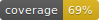

PYTHON-MOLONI
==============

# Moloni API

A wrapper to access **Moloni's API** with an easy-to-use interface.

# Documentation

[](https://python-moloni.readthedocs.io/en/latest/)


## Usage:

#### Full configuration

```python
from moloni.api.companies_client import CompaniesClient
from moloni.base import AuthConfig, MoloniBaseUrl
import logging

logger = logging.getLogger(__name__)


companies = CompaniesClient(
    environment=MoloniBaseUrl.PROD,
    auth_config=AuthConfig(
        client_id="your_client_id",
        client_secret="your_client_secret",
        username="your_username",  # Optional if refresh_token is set
        password="your_password",  # Optional if refresh_token is set
        refresh_token="your_refresh_token",  # Optional if username and password are set
    ),
    log_level="INFO",
    version="v1",
    validate=True,
)
logger.info(companies.get_all())

```

#### Minimal configuration, with credentials set as environment variables


```python
from moloni.api.companies_client import CompaniesClient
from moloni.api.products_client import ProductsClient, ProductsGetAllModel
import logging 

logger = logging.getLogger(__name__)


companies = CompaniesClient()
logger.info(companies.get_all())
products = ProductsClient()
logger.info(products.get_all(dict(company_id=5, category_id=8231525)))

product = products.insert(
    dict(
        company_id=5,
        category_id=123456,
        unit_id=134568,
        has_stock="0",
        name="Name",
        reference="Reference",
        price="10",
        type="1",
        taxes=[{"tax_id": 123455, "order": 0, "cumulative": 0}],
    )
)

#  or with a model

products_response = products.get_all(
    ProductsGetAllModel(company_id=5, category_id=8231525)
)

```

## Environment Variables

To setup auth through environment variables, you can set the following variables:

```python

client_id: str = os.getenv("MOLONI_CLIENT_ID")
client_secret: str = os.getenv("MOLONI_CLIENT_SECRET")
refresh_token: str = os.getenv("MOLONI_REFRESH_TOKEN")
username: str = os.getenv("MOLONI_USERNAME")
password: str = os.getenv("MOLONI_PASSWORD")

```

[](./coverage.svg)

##### Disclaimer

We are not affiliated with Moloni, this is an unofficial wrapper to access their API. For more information, please visit their [official website](https://www.moloni.pt/).
